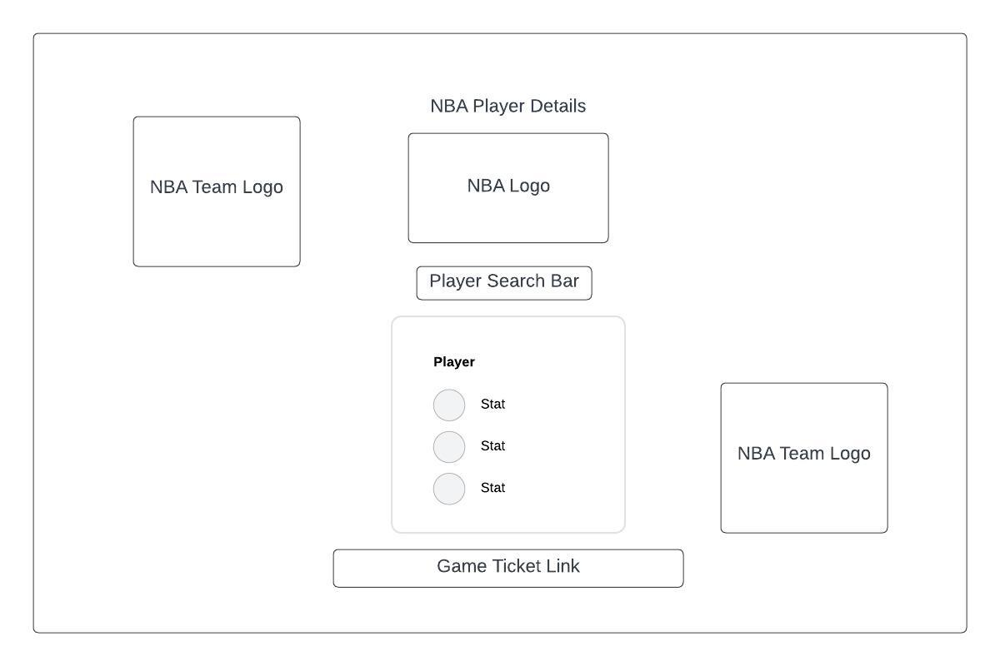

# NBA Player Details

## Overview

NBA Player Details is a web application designed for basketball enthusiasts to quickly and easily find details about their favorite NBA players. This application presents player information in a visually appealing format, inspired by NBA trading cards. Users can search for players by name and view essential details like team affiliation, height, position, weight, and more.

## Features

### Player Search:
* Allows users to search for NBA players by name.
### Player Cards: 
* Displays player information in a card-like format, including team details and physical attributes.

## Technologies Used

* HTML
* CSS
* JavaScript
* jQuery

# Getting Started
## Prerequisites
* A modern web browser like Chrome, Firefox, or Safari.
* Basic understanding of HTML, CSS, and JavaScript.

## Installation
* Clone the Repository: Clone the project repository to your local machine using:

* bash
* Copy code
* git clone https://github.com/rlacerna/NBA-Player-Detail-Project.git
* Navigate to the Project Directory: Change to the project directory.

## Usage
* Start the Application: Open the index.html file in a web browser.
* Enter a Player's Name: Type the name of an NBA player in the search input box.
* View Player Details: Click on the 'Search' button to view the player's details presented in a card format.

## Contributing
We welcome contributions to the NBA Player Details project. If you have suggestions for improvements or bug fixes, please feel free to fork the repository and submit a pull request.

## Acknowledgments
* NBA data provided by Ball Don't Lie API
* Icons and images used under Creative Commons license.

## Contact
For any additional questions or comments, please email renzlacerna13@gmail.com

